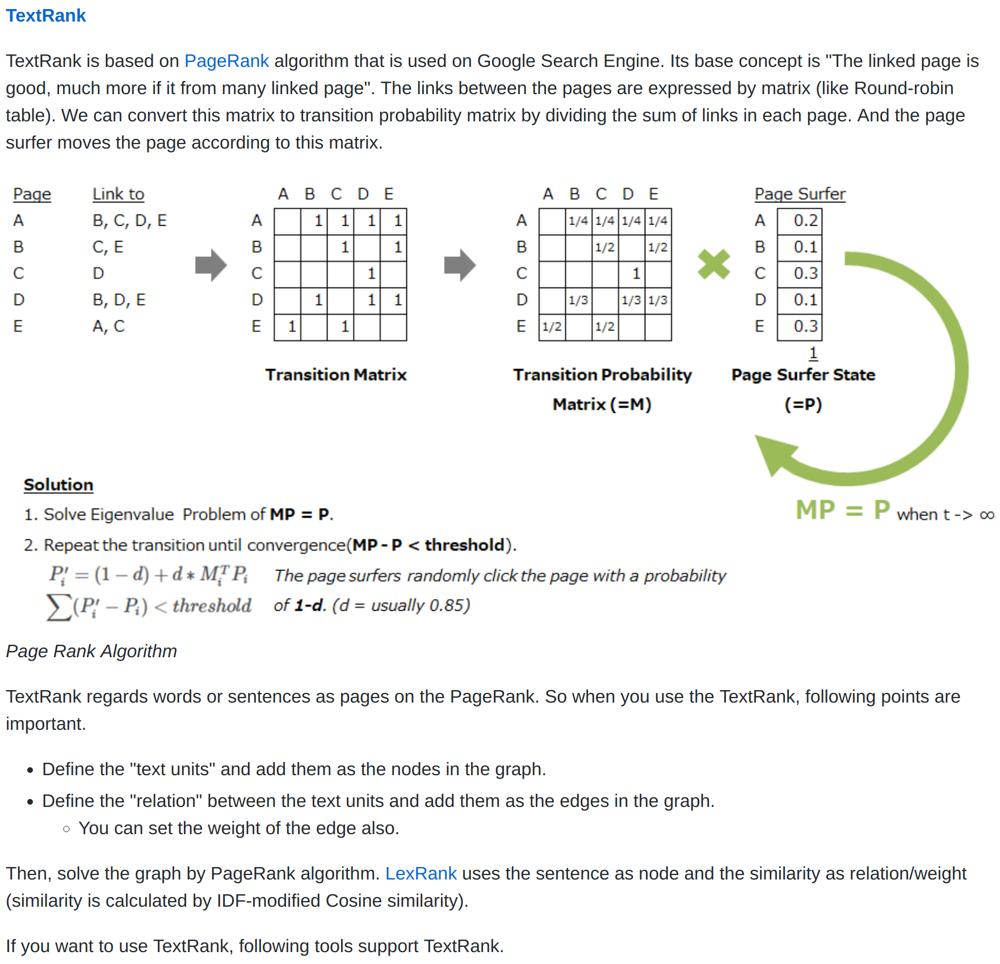
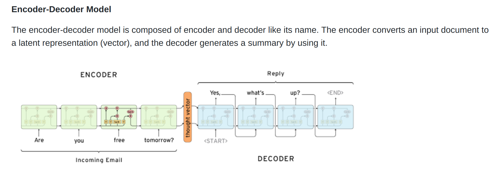

# CNN News Story Dataset

##### 任务简介
Summary: 给定长文本(story), 生成摘要(highlight), 数据集采用CNN News Story Dataset．

**解压数据**

```sh
$ cd data
$ unzip cnn_stories_tokenized.zip
```

##### 数据加载
```python
from load_data import load_stories

directory = 'data/cnn_stories_tokenized/'
stories = load_stories(directory, 10000)
print('Loaded Stories %d' % len(stories))
```

**原始文本**

```text
# 原始文本
Atlanta -LRB- CNN -RRB- -- A young girl bravely stood to ask the Dalai Lama 's doctor a question , and he gave her an unusual answer .
Dr. Tsewang Tamdin , a world-renowned expert in Tibetan medicine , visited Emory University in Atlanta on Monday as part of his effort to reach more American medical practitioners . He wants to develop collaborative projects between the Tibetan medicine system , which is more than 2,500 years old , and Western medicine .
The little girl told Tamdin she suffered from asthma . She wanted to know if there was anything in Tibetan medicine that could help her get better .
Tamdin , who spoke through a translator for ...

# 参考摘要1
Tibetan medical experts want more collaborative projects with modern medicine
# 参考摘要2
Tibetan doctors sometimes prescribe kindness and compassion to cure illness
```


**相关summarize工具**

- summarize(实现了TextRank的工具包)
```python
from gensim.summarization.summarizer import summarize
```

**依赖**
- gensim
- sumeval


##### 任务
- **抽取式算法**  (要求手写这部分代码)



- **生成式算法** (了解)




##### Summary Eval

摘要的评测指标采用了Rouge和Bleu，使用python sumeval可实现评测，使用方法如下．

- Rouge Metric
```python
from sumeval.metrics.rouge import RougeCalculator


rouge = RougeCalculator(stopwords=True, lang="en")

rouge_1 = rouge.rouge_n(
            summary="I went to the Mars from my living town.",
            references="I went to Mars",
            n=1)

rouge_2 = rouge.rouge_n(
            summary="I went to the Mars from my living town.",
            references=["I went to Mars", "It's my living town"],
            n=2)

rouge_l = rouge.rouge_l(
            summary="I went to the Mars from my living town.",
            references=["I went to Mars", "It's my living town"])

# You need spaCy to calculate ROUGE-BE

rouge_be = rouge.rouge_be(
            summary="I went to the Mars from my living town.",
            references=["I went to Mars", "It's my living town"])

print("ROUGE-1: {}, ROUGE-2: {}, ROUGE-L: {}, ROUGE-BE: {}".format(
    rouge_1, rouge_2, rouge_l, rouge_be
).replace(", ", "\n"))
```
- Bleu Metric
```python
from sumeval.metrics.bleu import BLEUCalculator


bleu = BLEUCalculator()
score = bleu.bleu("I am waiting on the beach",
                  "He is walking on the beach")
```
